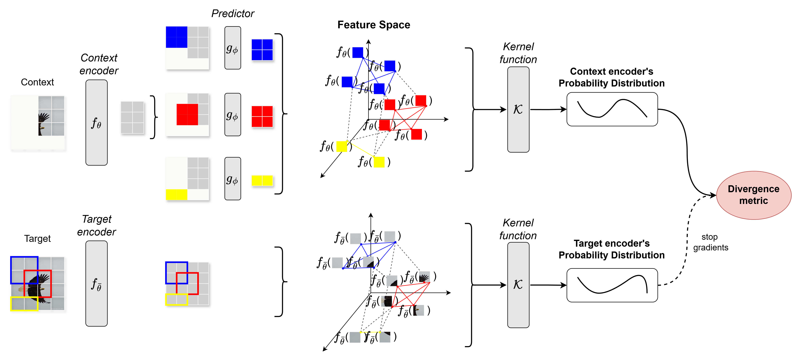

# Probabilistic I-JEPA

Official PyTorch codebase for the Probabilistic I-JEPA (the **Probabilistic Image-based Joint-Embedding Predictive Architecture**). [\[JEPAs\]](https://ai.facebook.com/blog/yann-lecun-advances-in-ai-research/) [\[blogpost\]](https://ai.facebook.com/blog/yann-lecun-ai-model-i-jepa/)  
<!-- published @ CVPR-23 -->
<!-- [\[arXiv\]](https://arxiv.org/pdf/2301.08243.pdf) --> 

## Method
I-JEPA is a method for self-supervised learning. At a high level, I-JEPA predicts the representations of part of an image from the representations of other parts of the same image. We propose a probabilistic formulation, namely the Probabilistic I-JEPA, which involves matching the conditional probability distributions between the target and the predicted representations.
Notably, this approach learns semantic image features:
1. without relying on pre-specified invariances to hand-crafted data transformations, which tend to be biased for particular downstream tasks,
2. without having the model fill in pixel-level details, which tend to result in learning less semantically meaningful representations, 
3. and by matching the conditional probability distributions it manages to output richer image representations.

<!-- ### I-JEPA architecture
 -->

### Probabilistic I-JEPA architecture


## Visualizations

As opposed to generative methods that have a pixel decoder, I-JEPA has a predictor that makes predictions in latent space.
The predictor in I-JEPA can be seen as a primitive (and restricted) world-model that is able to model spatial uncertainty in a static image from a partially observable context.
This world model is semantic in the sense that it predicts high level information about unseen regions in the image, rather than pixel-level details.

We trained a stochastic decoder that maps the I-JEPA predicted representations back in pixel space as sketches.
The model correctly captures positional uncertainty and produces high-level object parts with the correct pose (e.g., dog’s head, wolf’s front legs).


<sub>
Caption: Illustrating how the predictor learns to model the semantics of the world. For each image, the portion outside of the blue box is encoded and given to the predictor as context. The predictor outputs a representation for what it expects to be in the region within the blue box. To visualize the prediction, we train a generative model that produces a sketch of the contents represented by the predictor output, and we show a sample output within the blue box. The predictor recognizes the semantics of what parts should be filled in (the top of the dog’s head, the bird’s leg, the wolf’s legs, the other side of the building).
</sub>

## Evaluations

I-JEPA pretraining is also computationally efficient.
It does not involve any overhead associated with applying more computationally intensive data augmentations to produce multiple views.
Only one view of the image needs to be processed by the target encoder, and only the context blocks need to be processed by the context encoder.
Empirically, I-JEPA learns strong off-the-shelf semantic representations without the use of hand-crafted view augmentations.


### I-JEPA vs Probabilistic I-JEPA 

The proposed approach consistently outperforms the original I-JEPA in downstream classification tasks, as measured by both linear probing and k-NN evaluation. This is done with a negligent impact in the pretraining time needed.

<table>
  <tr>
    <th rowspan="2" style="text-align:center;">Dataset</th>
    <th colspan="2" style="text-align:center;">KNN</th>
    <th colspan="2" style="text-align:center;">Linear Probing</th>
  </tr>
  <tr>
    <th>I-JEPA</th>
    <th>Probabilistic I-JEPA</th>
    <th>I-JEPA</th>
    <th>Probabilistic I-JEPA</th>
  </tr>
  <tr>
    <td>IIC</td>
    <td>57.55</td>
    <td><strong>58.46</strong> <span style="color: gray;">(+0.91)</span></td>
    <td>78.23</td>
    <td><strong>80.43</strong> <span style="color: gray;">(+2.20)</span></td>
  </tr>
  <tr>
    <td>STL-10</td>
    <td>37.91</td>
    <td><strong>42.75</strong> <span style="color: gray;">(+4.84)</span></td>
    <td>68.75</td>
    <td><strong>72.52</strong> <span style="color: gray;">(+3.77)</span></td>
  </tr>
  <tr>
    <td>ImageNet100</td>
    <td>37.16</td>
    <td><strong>43.41</strong> <span style="color: gray;">(+6.25)</span></td>
    <td>56.46</td>
    <td><strong>57.54</strong> <span style="color: gray;">(+1.08)</span></td>
  </tr>
</table>

<!-- ## Pretrained models for the original I-JEPA

<table>
  <tr>
    <th colspan="1">arch.</th>
    <th colspan="1">patch size</th>
    <th colspan="1">resolution</th>
    <th colspan="1">epochs</th>
    <th colspan="1">data</th>
    <th colspan="3">download</th>
  </tr>
  <tr>
    <td>ViT-H</td>
    <td>14x14</td>
    <td>224x224</td>
    <td>300</td>
    <td>ImageNet-1K</td>
    <td><a href="https://dl.fbaipublicfiles.com/ijepa/IN1K-vit.h.14-300e.pth.tar">full checkpoint</a></td>
    <td><a href="https://dl.fbaipublicfiles.com/ijepa/IN1K-vit.h.14-logs-rank.0.csv">logs</a></td>
    <td><a href="https://github.com/facebookresearch/ijepa/blob/main/configs/in1k_vith14_ep300.yaml">configs</a></td>
  </tr>
  <tr>
    <td>ViT-H</td>
    <td>16x16</td>
    <td>448x448</td>
    <td>300</td>
    <td>ImageNet-1K</td>
    <td><a href="https://dl.fbaipublicfiles.com/ijepa/IN1K-vit.h.16-448px-300e.pth.tar">full checkpoint</a></td>
    <td><a href="https://dl.fbaipublicfiles.com/ijepa/IN1K-vit.h.16.448-logs-rank.0.csv">logs</a></td>
    <td><a href="https://github.com/facebookresearch/ijepa/blob/main/configs/in1k_vith16-448_ep300.yaml">configs</a></td>
  </tr>
  <tr>
    <td>ViT-H</td>
    <td>14x14</td>
    <td>224x224</td>
    <td>66</td>
    <td>ImageNet-22K</td>
    <td><a href="https://dl.fbaipublicfiles.com/ijepa/IN22K-vit.h.14-900e.pth.tar">full checkpoint</a></td>
    <td><a href="https://dl.fbaipublicfiles.com/ijepa/IN22K-vit.h.14-logs-rank.0.csv">logs</a></td>
    <td><a href="https://github.com/facebookresearch/ijepa/blob/main/configs/in22k_vith14_ep66.yaml">configs</a></td>
  </tr>
  <tr>
    <td>ViT-g</td>
    <td>16x16</td>
    <td>224x224</td>
    <td>44</td>
    <td>ImageNet-22K</td>
    <td><a href="https://dl.fbaipublicfiles.com/ijepa/IN22K-vit.g.16-600e.pth.tar">full checkpoint</a></td>
    <td><a href="https://dl.fbaipublicfiles.com/ijepa/IN22K-vit.g.16-logs-rank.0.csv">logs</a></td>
    <td><a href="https://github.com/facebookresearch/ijepa/blob/main/configs/in22k_vitg16_ep44.yaml">configs</a></td>
  </tr>
</table> -->

## Code Structure

```
.
├── configs                   # directory in which all experiment '.yaml' configs are stored
├── src                       # the package
│   ├── train.py              #   the I-JEPA training loop
│   ├── helper.py             #   helper functions for init of models & opt/loading checkpoint
│   ├── transforms.py         #   pre-train data transforms
│   ├── PKT.py                #   implementation for matching probability distributions between representations
│   ├── which_loss.py         #   various loss function combinations picked by config file
│   ├── datasets              #   datasets, data loaders, ...
│   ├── models                #   model definitions
│   ├── masks                 #   mask collators, masking utilities, ...
│   └── utils                 #   shared utilities
├── main_distributed.py       # entrypoint for launch distributed I-JEPA pretraining on SLURM cluster
└── main.py                   # entrypoint for launch I-JEPA pretraining locally on your machine
```

**Config files:**
Note that all experiment parameters are specified in config files (as opposed to command-line-arguments). See the [configs/](configs/) directory for example config files.

## Launching Probabilistic I-JEPA pretraining

### Single-GPU training
This implementation starts from the [main.py](main.py), which parses the experiment config file and runs the pre-training locally on a multi-GPU (or single-GPU) machine. For example, to run I-JEPA pretraining on GPUs "0","1", and "2" on a local machine using the config [configs/in1k_vith14_ep300.yaml](configs/in1k_vith14_ep300.yaml), type the command:
```
python main.py \
  --fname configs/in1k_vith14_ep300.yaml \
  --devices cuda:0 cuda:1 cuda:2
```
*Note: This example is just used for illustrative purposes, as the ViT-H/14 config should be run on 16 A100 80G GPUs for an effective batch-size of 2048, in order to reproduce our results.*

To run the Probabilistic I-JEPA, make sure the loss function in the config file is set to *L2_PKT*. 

<!-- ### Multi-GPU training
In the multi-GPU setting, the implementation starts from [main_distributed.py](main_distributed.py), which, in addition to parsing the config file, also allows for specifying details about distributed training. For distributed training, we use the popular open-source [submitit](https://github.com/facebookincubator/submitit) tool and provide examples for a SLURM cluster.

For example, to pre-train on 16 A100 80G GPUs using the pre-training experiment configs specificed inside [configs/in1k_vith14_ep300.yaml](configs/in1k_vith14_ep300.yaml), type the command:
```
python main_distributed.py \
  --fname configs/in1k_vith14_ep300.yaml \
  --folder $path_to_save_submitit_logs \
  --partition $slurm_partition \
  --nodes 2 --tasks-per-node 8 \
  --time 1000
``` -->

### Using a trained encoder

In order to use an encoder, load its weights into memory and extract features from images. Make sure the images are of the same size with those the encoder was trained on. Then these features can be used however one wishes.


### Requirements
* Python 3.8 (or newer)
* PyTorch 2.0
* torchvision
* Other dependencies: pyyaml, numpy, opencv, submitit

## License
See the [LICENSE](./LICENSE) file for details about the license under which this code is made available.

## Citation
If you find the [original repository](https://github.com/facebookresearch/ijepa) useful in your research, please consider giving a star :star: and a citation
```
@article{assran2023self,
  title={Self-Supervised Learning from Images with a Joint-Embedding Predictive Architecture},
  author={Assran, Mahmoud and Duval, Quentin and Misra, Ishan and Bojanowski, Piotr and Vincent, Pascal and Rabbat, Michael and LeCun, Yann and Ballas, Nicolas},
  journal={arXiv preprint arXiv:2301.08243},
  year={2023}
}
