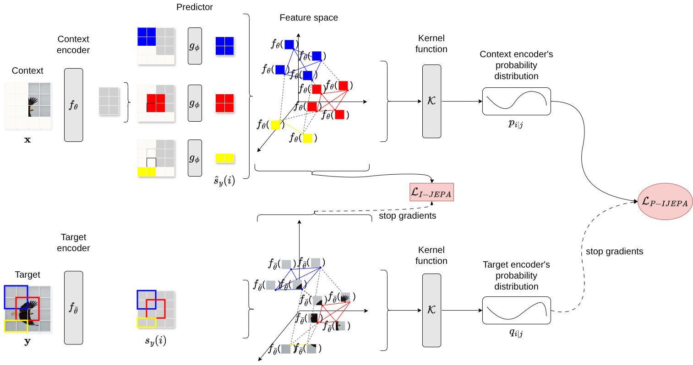

# Probabilistic I-JEPA

Official PyTorch implementation of **Probabilistic Image-based Joint Embedding Predictive Architecture (P-IJEPA)**.

[[Paper](https://doi.org/10.1016/j.patrec.2026.07.005)] [[JEPAs](https://ai.facebook.com/blog/yann-lecun-advances-in-ai-research/)] [[I-JEPA blog post](https://ai.facebook.com/blog/yann-lecun-ai-model-i-jepa/)]

> Lazaros Gogos, Dimitrios Katsikas, Nikolaos Passalis, and Anastasios Tefas. “Probabilistic image-based joint embedding predictive architecture.” *Pattern Recognition Letters*, 207:234–240, 2026.

## Method
I-JEPA learns visual representations by predicting the latent representations of masked target blocks from a visible context block. Its pointwise reconstruction objective, however, focuses on matching individual target representations and does not explicitly preserve the local geometry among patches.

P-IJEPA augments the pointwise objective with probabilistic knowledge transfer. It models the conditional probability distributions of the target and predicted patch representations using kernel density estimation and pairwise cosine similarities, then aligns them with a KL-divergence loss. The combined objective preserves both representation-level correspondence and the local geometric relationships between patches, encouraging richer semantic representations without pixel-level reconstruction or strong hand-crafted view augmentations.

<!-- ### I-JEPA architecture
 -->

### Probabilistic I-JEPA architecture


<!-- ## Visualizations

As opposed to generative methods that have a pixel decoder, I-JEPA has a predictor that makes predictions in latent space.
The predictor in I-JEPA can be seen as a primitive (and restricted) world-model that is able to model spatial uncertainty in a static image from a partially observable context.
This world model is semantic in the sense that it predicts high level information about unseen regions in the image, rather than pixel-level details.

We trained a stochastic decoder that maps the I-JEPA predicted representations back in pixel space as sketches.
The model correctly captures positional uncertainty and produces high-level object parts with the correct pose (e.g., dog’s head, wolf’s front legs).


<sub>
Caption: Illustrating how the predictor learns to model the semantics of the world. For each image, the portion outside of the blue box is encoded and given to the predictor as context. The predictor outputs a representation for what it expects to be in the region within the blue box. To visualize the prediction, we train a generative model that produces a sketch of the contents represented by the predictor output, and we show a sample output within the blue box. The predictor recognizes the semantics of what parts should be filled in (the top of the dog’s head, the bird’s leg, the wolf’s legs, the other side of the building).
</sub> -->

## Probabilistic I-JEPA evaluations

The paper evaluates frozen representations with k-NN classification, linear probing, and transfer learning. P-IJEPA consistently improves on I-JEPA across the reported datasets, architectures, and pretraining lengths.

### ViT-B results

Validation accuracy after 500 epochs of pretraining (mean ± standard deviation over three seeds):

| Dataset | I-JEPA k-NN | P-IJEPA k-NN | I-JEPA linear | P-IJEPA linear |
|---|---:|---:|---:|---:|
| IIC | 57.84 ± 1.70 | **59.57 ± 1.69** | 78.74 ± 0.59 | **80.13 ± 0.48** |
| STL-10 | 38.07 ± 1.77 | **42.75 ± 1.03** | 68.82 ± 0.29 | **72.44 ± 0.52** |
| ImageNet-100 | 39.16 ± 1.26 | **44.92 ± 2.81** | 56.79 ± 1.18 | **58.20 ± 1.04** |

### CNN-JEPA results

The same probabilistic objective also improves CNN-JEPA with a ResNet-50 backbone after 200 epochs of pretraining:

| Dataset | CNN-JEPA k-NN | Proposed k-NN | CNN-JEPA linear | Proposed linear |
|---|---:|---:|---:|---:|
| IIC | 89.10 | **89.33** | 92.07 | **92.30** |
| CIFAR-10 | 56.33 | **57.40** | 72.91 | **74.69** |
| CIFAR-100 | 28.47 | **29.00** | 48.58 | **49.00** |
| STL-10 | 58.44 | **58.53** | 72.84 | **73.60** |
| ImageNet-100 | 59.46 | **59.80** | 76.84 | **77.26** |

### Transfer learning

Linear-probe accuracy after pretraining on ImageNet-100:

| Evaluation dataset | I-JEPA | P-IJEPA | Improvement |
|---|---:|---:|---:|
| CIFAR-10 | 75.32 | **78.29** | +2.97 |
| CIFAR-100 | 51.86 | **55.62** | +3.76 |
| STL-10 | 75.77 | **77.48** | +1.71 |

P-IJEPA also produces lower context-target Gram-matrix divergence, indicating better preservation of pairwise relationships between target patches. The best reported weighting for the probabilistic term is `beta = 1`.

The distribution-matching objective introduces limited computational overhead. On IIC, per-epoch time changes from 1:21 to 1:22 and GPU memory usage from 7.60 GB to 7.80 GB; the corresponding figures are 6:36 to 6:41 with unchanged 8.15 GB memory on STL-10, and 3:00 to 3:15 with 20.05 GB to 21.25 GB memory on ImageNet-100.

<!-- 
 -->

<!-- ## Pretrained models for the original I-JEPA

<table>
  <tr>
    <th colspan="1">arch.</th>
    <th colspan="1">patch size</th>
    <th colspan="1">resolution</th>
    <th colspan="1">epochs</th>
    <th colspan="1">data</th>
    <th colspan="3">download</th>
  </tr>
  <tr>
    <td>ViT-H</td>
    <td>14x14</td>
    <td>224x224</td>
    <td>300</td>
    <td>ImageNet-1K</td>
    <td><a href="https://dl.fbaipublicfiles.com/ijepa/IN1K-vit.h.14-300e.pth.tar">full checkpoint</a></td>
    <td><a href="https://dl.fbaipublicfiles.com/ijepa/IN1K-vit.h.14-logs-rank.0.csv">logs</a></td>
    <td><a href="https://github.com/facebookresearch/ijepa/blob/main/configs/in1k_vith14_ep300.yaml">configs</a></td>
  </tr>
  <tr>
    <td>ViT-H</td>
    <td>16x16</td>
    <td>448x448</td>
    <td>300</td>
    <td>ImageNet-1K</td>
    <td><a href="https://dl.fbaipublicfiles.com/ijepa/IN1K-vit.h.16-448px-300e.pth.tar">full checkpoint</a></td>
    <td><a href="https://dl.fbaipublicfiles.com/ijepa/IN1K-vit.h.16.448-logs-rank.0.csv">logs</a></td>
    <td><a href="https://github.com/facebookresearch/ijepa/blob/main/configs/in1k_vith16-448_ep300.yaml">configs</a></td>
  </tr>
  <tr>
    <td>ViT-H</td>
    <td>14x14</td>
    <td>224x224</td>
    <td>66</td>
    <td>ImageNet-22K</td>
    <td><a href="https://dl.fbaipublicfiles.com/ijepa/IN22K-vit.h.14-900e.pth.tar">full checkpoint</a></td>
    <td><a href="https://dl.fbaipublicfiles.com/ijepa/IN22K-vit.h.14-logs-rank.0.csv">logs</a></td>
    <td><a href="https://github.com/facebookresearch/ijepa/blob/main/configs/in22k_vith14_ep66.yaml">configs</a></td>
  </tr>
  <tr>
    <td>ViT-g</td>
    <td>16x16</td>
    <td>224x224</td>
    <td>44</td>
    <td>ImageNet-22K</td>
    <td><a href="https://dl.fbaipublicfiles.com/ijepa/IN22K-vit.g.16-600e.pth.tar">full checkpoint</a></td>
    <td><a href="https://dl.fbaipublicfiles.com/ijepa/IN22K-vit.g.16-logs-rank.0.csv">logs</a></td>
    <td><a href="https://github.com/facebookresearch/ijepa/blob/main/configs/in22k_vitg16_ep44.yaml">configs</a></td>
  </tr>
</table> -->

## Code Structure

```
.
├── configs                   # directory in which all experiment '.yaml' configs are stored
├── src                       # the package
│   ├── train.py              #   the I-JEPA training loop
│   ├── helper.py             #   helper functions for init of models & opt/loading checkpoint
│   ├── transforms.py         #   pre-train data transforms
│   ├── PKT.py                #   implementation for matching probability distributions between representations
│   ├── which_loss.py         #   various loss function combinations picked by config file
│   ├── datasets              #   datasets, data loaders, ...
│   ├── models                #   model definitions
│   ├── masks                 #   mask collators, masking utilities, ...
│   └── utils                 #   shared utilities
├── main_distributed.py       # entrypoint for launch distributed I-JEPA pretraining on SLURM cluster
└── main.py                   # entrypoint for launch I-JEPA pretraining locally on your machine
```

**Config files:**
Note that all experiment parameters are specified in config files (as opposed to command-line-arguments). See the [configs/](configs/) directory for example config files.

## Launching Probabilistic I-JEPA pretraining

### Single-GPU training
This implementation starts from the [main.py](main.py), which parses the experiment config file and runs the pre-training locally on a multi-GPU (or single-GPU) machine. For example, to run I-JEPA pretraining on GPUs "0","1", and "2" on a local machine using the config [configs/in1k_vith14_ep300.yaml](configs/in1k_vith14_ep300.yaml), type the command:
```
python main.py \
  --fname configs/in1k_vith14_ep300.yaml \
  --devices cuda:0 cuda:1 cuda:2
```
*Note: This example is just used for illustrative purposes, as the ViT-H/14 config should be run on 16 A100 80G GPUs for an effective batch-size of 2048, in order to reproduce our results.*

To run P-IJEPA, set the loss function in the config file to `L2_PKT`. This combines the original L2 representation-matching loss with the probabilistic distribution-matching loss described in the paper.

<!-- ### Multi-GPU training
In the multi-GPU setting, the implementation starts from [main_distributed.py](main_distributed.py), which, in addition to parsing the config file, also allows for specifying details about distributed training. For distributed training, we use the popular open-source [submitit](https://github.com/facebookincubator/submitit) tool and provide examples for a SLURM cluster.

For example, to pre-train on 16 A100 80G GPUs using the pre-training experiment configs specificed inside [configs/in1k_vith14_ep300.yaml](configs/in1k_vith14_ep300.yaml), type the command:
```
python main_distributed.py \
  --fname configs/in1k_vith14_ep300.yaml \
  --folder $path_to_save_submitit_logs \
  --partition $slurm_partition \
  --nodes 2 --tasks-per-node 8 \
  --time 1000
``` -->

### Using a trained encoder

In order to use an encoder, load its weights into memory and extract features from images. Make sure the images are of the same size with those the encoder was trained on. Then these features can be used however one wishes.

### Requirements
* Python 3.8 (or newer)
* PyTorch 2.0
* torchvision
* Other dependencies: pyyaml, numpy, opencv, submitit

## License
See the [LICENSE](./LICENSE) file for details about the license under which this code is made available.

## Citation
If you use this code or method in your research, please cite:

```bibtex
@article{gogos2026probabilistic,
  title   = {Probabilistic image-based joint embedding predictive architecture},
  author  = {Gogos, Lazaros and Katsikas, Dimitrios and Passalis, Nikolaos and Tefas, Anastasios},
  journal = {Pattern Recognition Letters},
  volume  = {207},
  pages   = {234--240},
  year    = {2026},
  doi     = {10.1016/j.patrec.2026.07.005}
}
```

This implementation builds on the [original I-JEPA repository](https://github.com/facebookresearch/ijepa):

```bibtex
@article{assran2023self,
  title={Self-Supervised Learning from Images with a Joint-Embedding Predictive Architecture},
  author={Assran, Mahmoud and Duval, Quentin and Misra, Ishan and Bojanowski, Piotr and Vincent, Pascal and Rabbat, Michael and LeCun, Yann and Ballas, Nicolas},
  journal={Proceedings of the IEEE/CVF Conference on Computer Vision and Pattern Recognition},
  pages={15619--15629},
  year={2023}
}
```
